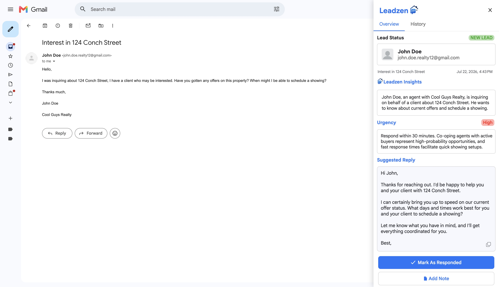
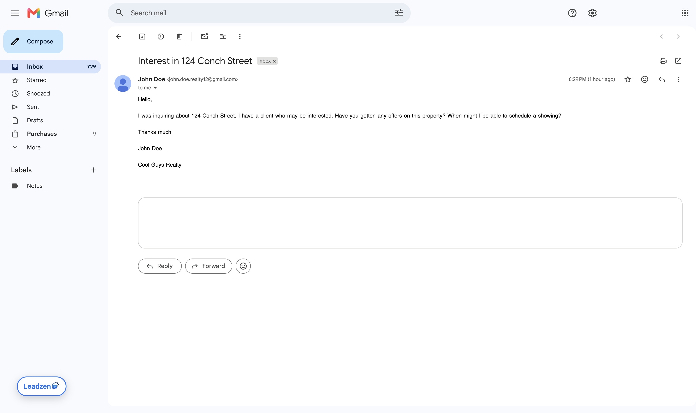
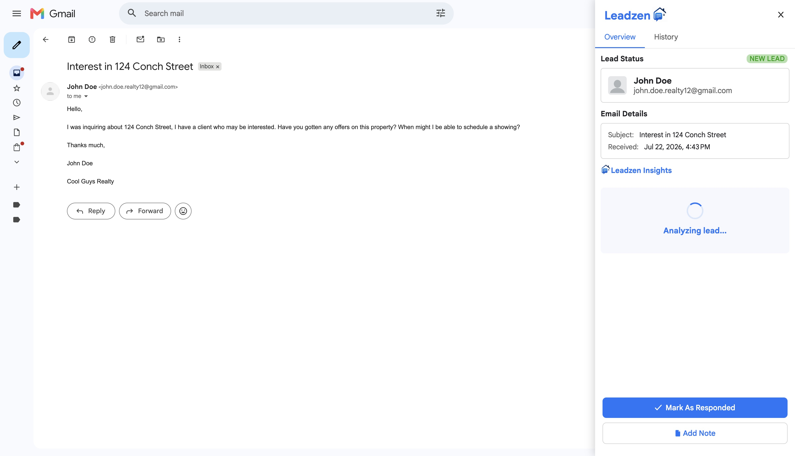

# Leadzen

Leadzen is a Chrome extension I'm building that will help real estate professionals manage, convert, and track leads.

  

### Version 1.0 Planned Features (in progress): 
---

[✔︎] Automatic content detection: Extension will pop up only as needed for emails relating to real estate.
 

[✔︎] Display sender and message details.
 

[✔︎] AI email analysis.

[✔︎] Urgency detection. (Is this person serious or just wasting time? Would it be tactical to respond now or later?)

[✔︎] Strategic suggested response. (What response is most likely to keep this lead moving through the sales pipeline?)
   

[&ensp;] Lead categories. (New lead, or previous client?)
 

[&ensp;] Lead analysis history.
 

#### Possible Future Version Additions:  
- More history detail (previous emails, dates, notes)  
- Pipeline status tracking (new? contacted? showing? closing?)

### About: 
---
Leadzen is a side project I'm building as I head into junior year of college. I wanted to create an application that allows me to learn and further develop my skills, and I also thought I'd make something that would help others and/or myself (win-win), so I looked at my workflow as a real estate agent and questioned what would make my life easier. I also wanted to explore the applications of AI in professional workflows.

### What is/will it be built with?
Frontend: 
- JavaScript 
- CSS 
- HTML 
- Chrome Extension APIs 

Backend: 
- Java Spring Boot
- REST APIs  

Database:
- PostgreSQL

Other:
- Gemini API

### Project Status:
---
I am currently improving the UI and working on persistent lead history via PostgreSQL.

#### See below for what I have so far. 

