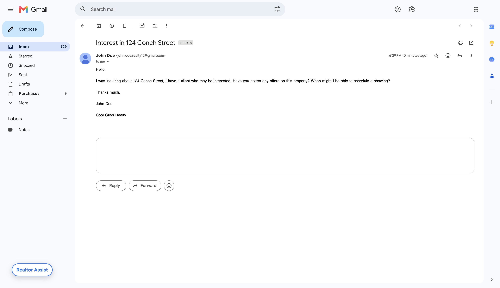
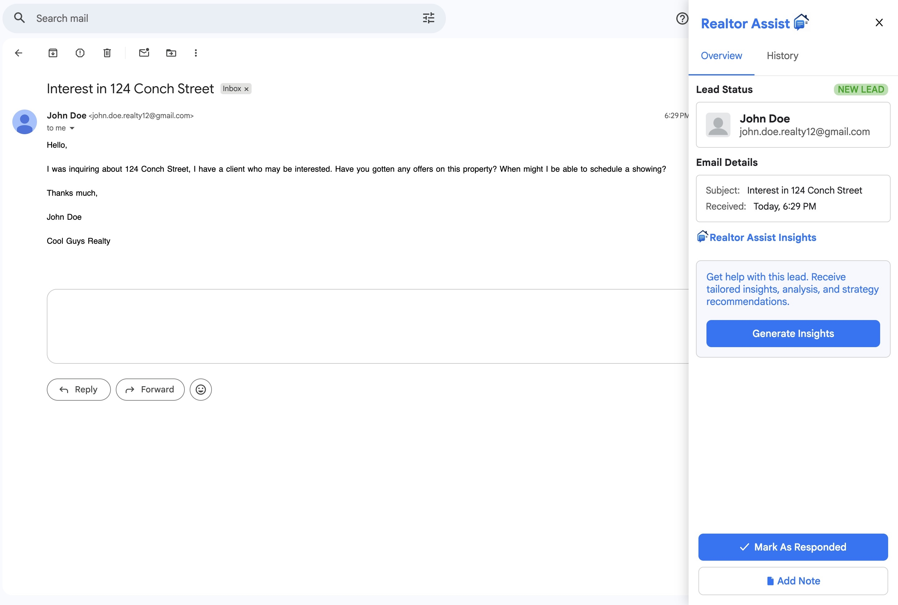
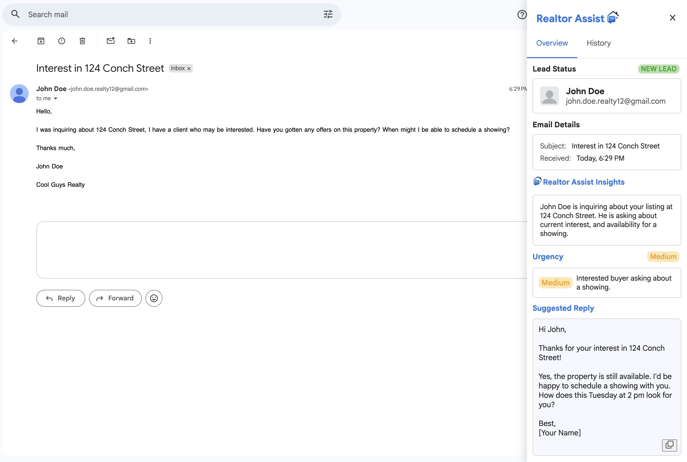

# Realtor Assist
Develop better client relationships, track and qualify leads, scale your business, and close more deals.  
  
### Ok... but like really, what is it?
Realtor Assist is a chrome extension i'm building that will help real estate professionals manage, convert, and track leads.  

#### Planned Features:  
- AI email analysis
- Urgency detection (is this person serious or just wasting time? Would it be strategic to respond immediately?)
- Suggested response
- Lead history (previous emails, dates, notes) 
- Lead categories (new lead, previous client)
- Pipeline status tracking (new? contacted? showing? closing?)
- Automatic content detection: It will pop-up only as needed for emails relating to real estate.

Realtor Assist is a side project i'm building as I head into junior year of college. I wanted to create an application that allows me to learn and further develop my skills and I also thought i'd make something that would help others and/or myself (win win), so I looked at my workflow as a real estate agent and questioned what would make my life easier. I also wanted to explore the applications of AI in professional workflows.

### What is/will it be built with?
Frontend: 
- JavaScript 
- CSS 
- inline HTML 
- Chrome Extension APIs 

Backend: 
- Java Spring Boot
- REST APIs  

Database:
- SQL

Other:
- AI API

### This project is in development
I am currently building out the UI layer, from there I will build out the backend. I will update this section to be a bit more specific in the future.   
#### See below for what I have so far. 

